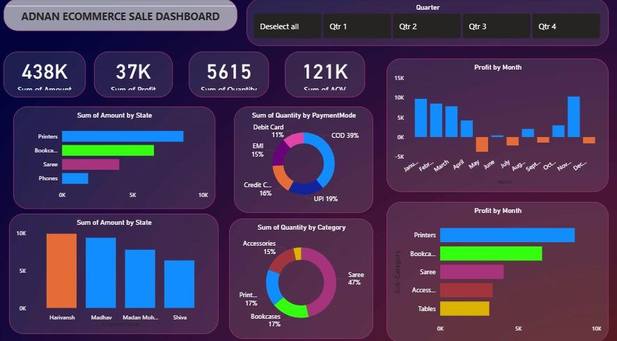

# 📊 E-Commerce Sales Analysis Dashboard

## 📖 Project Overview
Interactive Power BI dashboard analyzing e-commerce sales performance, focusing on revenue, profitability, and customer behavior.

## 🖼️ Dashboard Preview

## 📈 Key Metrics
* **Total Sales:** 438K
* **Total Profit:** 37K
* **Quantity Sold:** 5,615
* **Average Order Value:** 121K

## 🛠️ Technical Stack
* **Tool:** Power BI Desktop
* **ETL:** Power Query
* **Modeling:** DAX (Data Analysis Expressions)
* **Visuals:** High-contrast dark theme

## 📂 Project Structure
* `Adnan_Ecommerce_Sales.pbix`: Main Power BI file.
* `Data/`: Source dataset.
* `Images/`: Dashboard screenshots.

## 💡 Key Insights
* **Top Category:** Printers and Bookcases lead in revenue generation.
* **Payment Mode:** Cash on Delivery (COD) is dominant at 39%.
* **Profitability:** Significant growth trends observed in February and November.

---
**Author:** [AdnanCodex](https://github.com/AdnanCodex)
